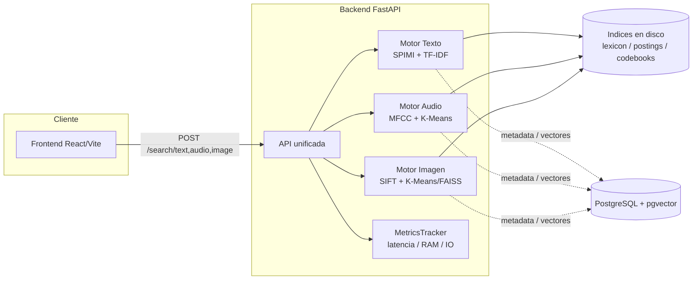

# Sistema Multimodal de Recuperación por Contenido

Motor de búsqueda que recupera contenido por **texto, audio e imagen** comparando el contenido real (letras, huella acústica, huella visual), no solo metadatos. Cada modalidad implementa su propio pipeline de indexado desde cero — **SPIMI + merge externo** para texto, **codebooks de K-Means** para audio e imagen — diseñado para operar con un uso acotado de RAM: la construcción del índice vigila la memoria RSS real del proceso en vez de estimarla, y la búsqueda solo mantiene en memoria las estructuras livianas (léxico, normas, IDF), resolviendo las listas de postings bajo demanda desde disco. Ver [Diseño de índices y uso de RAM](#diseño-de-índices-y-uso-de-ram).

Proyecto desarrollado para el curso de Base de Datos 2.

## Arquitectura



Cada motor se inicializa una única vez al levantar el servidor (evento `lifespan` de FastAPI) y queda en memoria durante toda la vida del proceso. Las búsquedas no vuelven a leer los datasets crudos: operan sobre las estructuras ya construidas (léxico, IDF, normas, codebooks).

## Modalidades

### Texto

Busca canciones a partir de fragmentos o consultas textuales.

- **Preprocesamiento**: tokenización, eliminación de stopwords y stemming (Porter, vía NLTK).
- **Construcción del índice — SPIMI (Single-Pass In-Memory Indexing)**: en vez de mantener el vocabulario completo en RAM, [`indexing/spimi.py`](texto/src/indexing/spimi.py) monitorea en vivo la memoria RSS real del proceso (`psutil`) mientras invierte el stream de tokens, y en cuanto se cruza un límite configurable vuelca (*flush*) un bloque ordenado a disco y arranca uno nuevo.
- **Fusión — merge externo k-way**: [`indexing/merger.py`](texto/src/indexing/merger.py) fusiona todos los bloques SPIMI con un heap (`heapq`), el algoritmo clásico de external merge sort, generando en el mismo paso el índice a nivel canción y a nivel chunk/párrafo.
- **Ranking**: TF-IDF con esquema de pesos log-tf (`(1 + log10(tf)) * idf`) y similitud coseno contra normas de documento precalculadas.
- **Búsqueda con RAM acotada**: solo el diccionario término → offset de bytes vive en memoria; las listas de postings se leen bajo demanda con `seek()` directo al índice en disco, únicamente para los términos de la consulta.

Devuelve tanto el ranking por canción completa como por fragmento relevante.

### Audio

Busca canciones por similitud acústica.

- **Extracción de características**: MFCC (20 coeficientes) sobre ventanas de 500 ms con 50% de solapamiento (`librosa`).
- **Codebook acústico — K-Means incremental**: `MiniBatchKMeans` (k=1000, scikit-learn) entrenado por lotes con `partial_fit`, procesando los audios en batches en vez de cargar el dataset completo de vectores MFCC en memoria a la vez.
- **Cuantización**: distancia euclidiana contra el codebook, que se carga con *memory-mapping* (`np.load(..., mmap_mode='r')`) para no materializarlo completo en RAM.
- **Índice invertido con arquitectura de offsets**: mismo patrón que texto — lexicon (palabra acústica → offset) en RAM, postings serializados en JSONL y leídos por `seek()` bajo demanda.
- **Ranking**: TF-IDF + similitud coseno sobre el histograma de palabras acústicas.

### Imagen

Busca productos visualmente similares.

- **Descriptores locales**: SIFT (OpenCV), invariantes a escala y rotación.
- **Codebook visual — K-Means**: entrenado offline sobre una muestra de descriptores (`sample_ratio=0.2`, leídos por mmap para no cargar todos los chunks a la vez). Es el único paso de todo el proyecto acelerado por GPU: usa `faiss.Kmeans(..., gpu=True)` y extracción SIFT con `kornia` en CUDA — el resultado (`codebook_kmeans.npy`) ya está versionado en el repo.
- **Cuantización (bag of visual words)**: asignación al centroide más cercano vía `faiss.IndexFlatL2` (búsqueda exacta por distancia L2).
- **Índice invertido con la misma arquitectura de offsets** (lexicon en RAM + postings en disco por `seek()`).
- **Ranking**: TF-IDF + similitud coseno sobre el histograma de palabras visuales.

## Diseño de índices y uso de RAM

Un mismo principio se repite a propósito en las tres modalidades: nunca cargar en memoria más de lo estrictamente necesario para resolver una consulta.

- **Construcción con límite de memoria explícito, no estimado**: SPIMI mide la memoria RSS real del proceso con `psutil` y decide cuándo volcar a disco en función de ese número, no de una estimación previa de cuánto vocabulario "debería" caber. El codebook acústico se entrena de la misma forma, incrementalmente, con `partial_fit` por lotes.
- **Lexicon en RAM, postings en disco**: las tres modalidades comparten la misma arquitectura de índice invertido — un diccionario liviano término/palabra → offset de bytes vive en memoria, y las listas de postings (lo pesado) se leen puntualmente con `seek()` solo para lo que la consulta realmente necesita.
- **Memory-mapping para artefactos grandes**: los codebooks de K-Means (audio e imagen) se cargan con `mmap_mode='r'` en vez de materializarse completos en RAM.
- **Métricas en vivo, no supuestos**: cada consulta pasa por [`MetricsTracker`](metrics.py), que mide latencia, memoria RSS del proceso, memoria delta usada y accesos a disco (lecturas/escrituras). Estos datos viajan en el header de respuesta `X-Search-Metrics` de cada endpoint de búsqueda, junto con el throughput acumulado por modalidad — pensado para poder auditar en vivo el costo real de cada tipo de búsqueda en vez de asumirlo.

## Stack tecnológico

| Capa | Tecnologías |
|---|---|
| Backend | Python, FastAPI, Uvicorn |
| Frontend | React, Vite, Tailwind CSS, React Router |
| Base de datos | PostgreSQL + pgvector |
| Procesamiento | NumPy, SciPy, scikit-learn, OpenCV/SIFT, Librosa, FAISS, NLTK |
| Infraestructura | Docker, Docker Compose |

## Estructura del repositorio

```text
.
├── backend.py              # API FastAPI unificada (texto/audio/imagen)
├── db.py                   # Conexión a PostgreSQL
├── metrics.py               # Tracker de latencia/RAM/IO por consulta
├── init.sql                 # Esquema de PostgreSQL (tablas + índices GIN/GIST/pgvector)
├── texto/
│   ├── src/                 # Preprocesamiento, chunking, construcción de índice, búsqueda
│   └── data/                # raw (gitignored) / processed / index
├── audio/
│   ├── src/                 # Extracción MFCC, codebook, indexador, motor de búsqueda
│   └── data/                # raw (gitignored) / processed / codebook
├── imagen/
│   ├── src/                 # SIFT, K-Means, construcción de índice, búsqueda local
│   └── data/                # raw (gitignored) / processed / codebook
├── frontend/                # SPA React (landing, búsqueda, resultados, detalle)
├── Dockerfile                # Imagen del backend
├── frontend/Dockerfile       # Imagen del frontend (build Vite + nginx)
└── docker-compose.yml        # Orquesta postgres + backend + frontend
```

## Puesta en marcha

Los índices ya construidos (léxicos, postings, codebooks) están incluidos en el repositorio dentro de cada `*/data/processed` y `*/data/codebook`, así que **la búsqueda funciona apenas se levanta el proyecto**, sin necesidad de descargar los datasets crudos ni recorrer los pipelines de indexado.

### Requisitos previos

- [Docker](https://docs.docker.com/get-docker/) + Docker Compose (opción recomendada), **o**
- Python 3.11, Node.js 20+ y una instancia de PostgreSQL con la extensión `pgvector` (opción manual)
- **No se necesita GPU** para correr el proyecto ni para buscar por texto, audio o imagen — todo el camino de búsqueda es CPU-only. La única excepción es reentrenar el codebook visual desde cero (`imagen/src/sift.py` + `kmeans.py`), un paso opcional que ya está resuelto en el repo (ver [Datasets y regeneración de índices](#datasets-y-regeneración-de-índices-opcional)).

### Opción A — Docker (recomendada)

```bash
git clone git@github.com:bruno-vega-11/multimodal-search-engine.git
cd multimodal-search-engine
cp .env.example .env
docker compose up --build
```

- Frontend: [http://localhost:5173](http://localhost:5173)
- Backend / docs interactivas: [http://localhost:8000/docs](http://localhost:8000/docs)
- PostgreSQL: expuesto en `localhost:5433`

El primer arranque de `postgres-pgvector` ejecuta automáticamente [init.sql](init.sql) para crear el esquema. El backend espera a que Postgres esté saludable (`healthcheck`) antes de arrancar.

### Opción B — Manual (sin Docker)

```bash
# 1. Backend
python -m venv venv
venv\Scripts\activate          # Windows
# source venv/bin/activate     # Linux/Mac
pip install -r requirements.txt

cp .env.example .env           # ajusta PGHOST/PGPORT/etc. si tu Postgres local difiere

# 2. Base de datos (Postgres local con pgvector ya instalado)
psql -h localhost -p 5433 -U postgres -d sistema_multimodal -f init.sql

# 3. Levantar el backend
uvicorn backend:app --reload --port 8000

# 4. Frontend (en otra terminal)
cd frontend
cp .env.example .env
npm install
npm run dev
```

### Variables de entorno

Ver [.env.example](.env.example) (raíz, usado por `db.py`/`backend.py`/Postgres) y [frontend/.env.example](frontend/.env.example) (usado por Vite). Copia cada uno a `.env` antes de correr el proyecto — ambos archivos `.env` están gitignorados a propósito.

## Datasets y regeneración de índices (opcional)

**No hace falta nada de esto para correr el proyecto**: los índices, léxicos y codebooks ya construidos están incluidos en el repo (`*/data/processed`, `*/data/codebook`), y tanto la búsqueda por texto/audio/imagen como el streaming de imágenes corren sobre esos artefactos ya generados. Esta sección es solo para quien quiera reconstruir un índice desde el dataset crudo.

| Modalidad | Dataset | Descarga | Pipeline | Hardware |
|---|---|---|---|---|
| Texto | Spotify Million Song Dataset | `python download_text_dataset.py` (Kaggle) | `python texto/src/main.py` | CPU, liviano |
| Imagen — histogramas + índice | Fashion Product Images Dataset | `python download_images_dataset.py` (Kaggle) | `python imagen/src/build_imagen_histograms.py` + `build_image_index.py` | CPU (usa el codebook visual ya existente) |
| Imagen — **reentrenar el codebook visual** | descriptores SIFT propios | — | `python imagen/src/sift.py` (extracción SIFT) + `python imagen/src/kmeans.py` (K-Means) | **GPU NVIDIA con CUDA y VRAM** — usan `kornia` en GPU y `faiss.Kmeans(..., gpu=True)` explícitamente |
| Audio | FMA Small | Descarga manual desde [freemusicarchive/fma](https://github.com/mdeff/fma) en `audio/data/raw/fma_small/` | `python audio/src/codebook_pipeline.py` + `indexer_pipeline.py` | CPU — pesado en tiempo/RAM (MFCC sobre miles de MP3), sin GPU |

Las descargas desde Kaggle usan `kagglehub` y requieren credenciales de Kaggle configuradas (`~/.kaggle/kaggle.json` o variables `KAGGLE_USERNAME`/`KAGGLE_KEY`).

> **Nota sobre GPU:** dentro de `imagen/src/`, `sift.py` y `kmeans.py` son el único paso de todo el proyecto que requiere GPU — sirven para entrenar los 1000 centroides del codebook visual (`codebook_kmeans.npy`) desde cero. Ese archivo ya está generado y versionado en el repo, así que **correr la app, hacer búsquedas por imagen, o incluso reconstruir los histogramas de todo el dataset (`build_imagen_histograms.py`) no requiere GPU** — usan `VisualQuantizer` (`cv2.SIFT` + `faiss-cpu`), 100% CPU. La GPU solo hace falta si se quiere reentrenar el codebook desde otro dataset o con otro `k`.

> El dataset de audio (FMA) no se re-descarga automáticamente: sin los MP3 originales en `audio/data/raw/`, la búsqueda por audio sigue funcionando contra el índice ya incluido, pero el endpoint de streaming (`/audio/stream/{id}`) no podrá reproducir el archivo físico.

## Endpoints principales

| Método | Ruta | Descripción |
|---|---|---|
| `POST` | `/search/text` | Búsqueda por texto (retorna ranking por canción y por chunk) |
| `POST` | `/search/audio` | Búsqueda por similitud acústica (sube un archivo de audio) |
| `POST` | `/search/image` | Búsqueda por similitud visual (sube una imagen) |
| `GET` | `/audio/stream/{audio_id}` | Streaming del audio original |
| `GET` | `/imagen/render/{imagen_id}` | Sirve la imagen original |

Documentación interactiva (Swagger) disponible en `/docs` con el backend corriendo.

## Licencia

Distribuido bajo licencia [MIT](LICENSE).

## Autores

Proyecto grupal del curso de Base de Datos 2.
